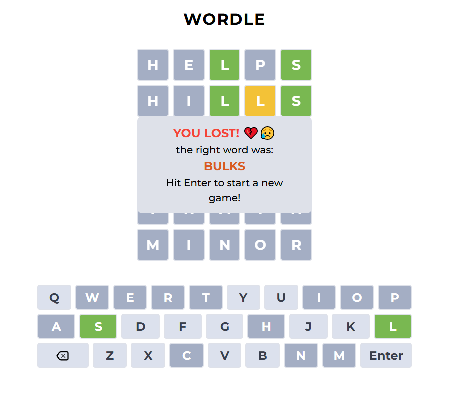

# Wordle Clone 🎯

A simple yet fun Wordle-style word guessing game built with **React** and **CSS**. This version challenges players to guess a secret 5-letter English word in six attempts or less.

---

## 🚀 Live Demo

[Click here to play](https://yacoubdweik.github.io/wordle/)

---

## 🧠 How to Play

- You have **6 attempts** to guess the hidden 5-letter word.
- After each guess, the game will color the letters:
  - 🟩 **Green** – correct letter in the correct position.
  - 🟨 **Yellow** – correct letter but wrong position.
  - ⬜️ **Gray** – letter not in the word at all.
- Press **Enter** to submit a word and **Backspace** to delete a letter.
- Only **valid English words** are accepted as guesses.

---

## 🛠 Tech Stack

- **React** (with `useReducer` for state management)
- **CSS** for styling
- All logic handled with **just one reducer** and **two core states**:
  - `inputWord`
  - `currentRow`

---

## 📁 File Structure Highlights

- `App.jsx` – Main logic and rendering
- `reducer.js` – Central state management via reducer
- `wordsList.js` – Valid word list source
- `components/` – UI components like `Word`
- `assets/` – Icons, styles, etc.

---

## 💡 Notes

This was built for learning and fun! The app avoids unnecessary complexity and keeps state minimal and manageable. No external word API or backend used.

---

## 📬 Feedback

If you have ideas or want to contribute, feel free to open an issue or a pull request!

---

### 🧠 Author: Yacoub Al Dweik
